# Understanding Machine Learning

## Course

- https://developers.google.com/machine-learning/crash-course
- This course is specifically on supervised machine learning

## Framing

- ML systems learn how to combine input to produce useful predictions on never-before-seen data

### Labels

- *Thing we're predicting* - the `y` variable in simple linear regression.
- Future price of wheat, type of animal in a picture, meaning of an audio clip, etc

### Feature

- Input variable - the `x` variable in simple linear regression
- Email spam detector example
  - Words in the email text
  - Sender's address
  - Time of day the email was sent
  - Email contains the phrase...

### Example

- Particular instance of data, **x**
- Two types of examples
  - Labeled examples
  - Unlabeled examples
- A **labeled example** contains both feature(s) and labels
  - Use these to `train` your model
  - Labeled examples would be individual emails that have explicitly marked as "spam" or "not spam"
- Following is an example of 5 labeled examples containing info about housing prices in California
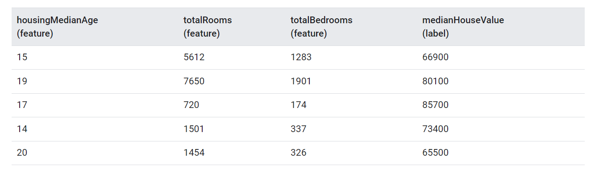
- An **unlabeled example** contains features but not the label
  - Note that it excludes `medianHouseValue`
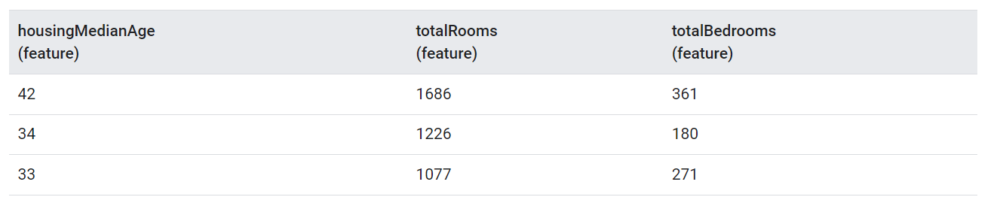

### Models

- Defines the relationship between features and label
- A spam detection model might associate certain features strongly with spam
- 2 phases of model's life
  - **Training** means creating or **learning** the model
    - Show the model labeled examples and enable the model to gradually learn the relationship 
      between features and label
  - **Inference** means applying the trained model to unlabeled examples
    - Use the trained model to make useful predictions

### Regression vs Classification

- A **regression** model predicts continuous values
  - What is the value of a house in California
  - What is the probability that a user will click on this ad
- A **classification** model predicts discrete values
  - Is the email message spam or not spam
  - Is this an image of a dog, a cat, or a hamster?

## Descending into ML

### Linear Regression

- Plot shows temperature rising with number of chirps

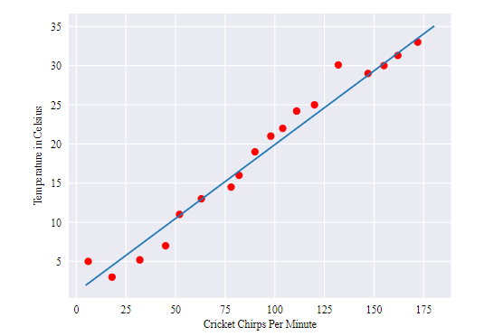

- *y = mx + b*
  - `y` is temperature in celsius - the value we're trying to predict
  - `m` is the slop of the line
  - `x` is the number of chirps per minute - value of our input feature
  - `b` is the y-intercept
- In ML, equation is y`<sup>'</sup> = b + w<sub>1</sub>x<sub>1</sub>
  - *y<sup>'</sup>* is the predicated label (a desired output)
  - *b* is the bias (y-intercept) sometimes referred to as *w<sub>0</sub>*
  - *w<sub>1</sub>* is the weight of feature 1
    - Weight is the same concept as "slope" *m* in the traditional equation of a line
  - *x<sub>1</sub>* is a feature (known input
- Can have multiple features
  - y' = b  + w<sub>1</sub>x<sub>1</sub> + w<sub>2</sub>x<sub>2</sub>

### Training and Loss

- **Training** a model means learning (determining) good values for all the weights and bias 
  from labeled examples
- In supervised learning, a machine learning algorithm builds a model by examining many examples 
  and attempting to find a model that minimizes loss; this is called **empirical risk minimization**
- **Loss** is a number indicating how bad the model's prediction was on a single example
  - If the model's prediction is perfect, the loss is zero; otherwise the loss is greater than 0
  - The goal of training a model is to find a set of weights and biases that have *low* loss
- Below example arrow represents loss, and blue lines represent predictions
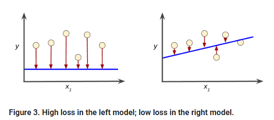

#### Squared Loss: A popular loss function

- Line regression model here uses a loss function called **squared loss** (also known as 
  L<sub>2</sub>loss)

```
  = the square of the difference between the label and the prediction
  = (observation - prediction(x))2
  = (y - y')2
```

- **Mean square error (MSE)** is the average squared loss per example over the whole dataset
- Sum up all the squared losses for individual examples and divide by the number of examples

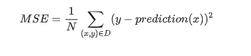

- An `(x, y)` is an example which
  - *x* is the set of features that the model uses to make predictions
  - *y* is the example's label
- `prediction(x)` is a function of the weights and bias in combination with the set of features *x*
- `D` is a dataset containing many labeled examples which are `(x,y)` pairs
- `N` is the number of examples in `D`

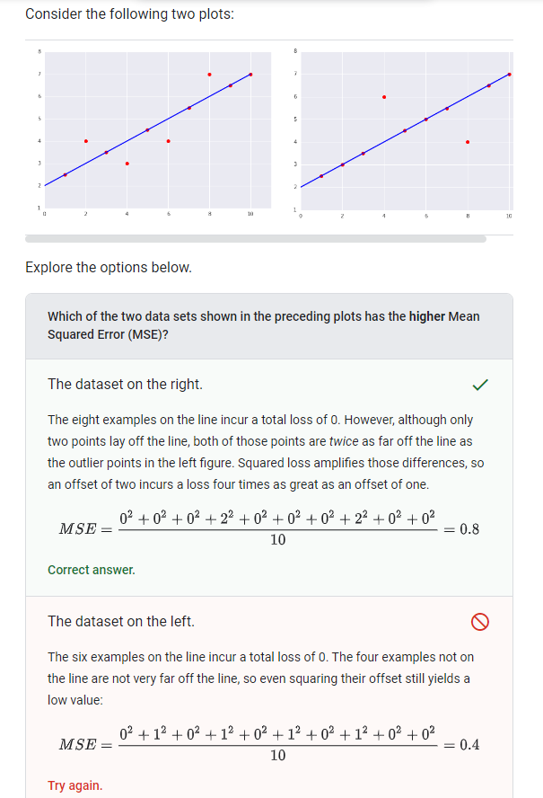

## Reducing Loss

### An Iterative Approach

- Iterative trial and error process

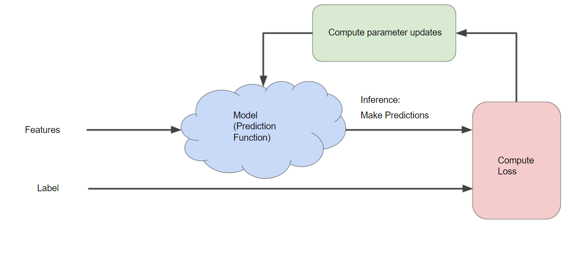

- The *model* takes one or more features as input and returns one prediction `y'` as output
  - *y' = b + w<sub>1</sub>x<sub>1</sub>
- What initial values should we set for *b* and *w~1~*
- *For linear regression problems, it turns out that the starting values aren't important. We 
  could pick random or trivial values*
  - `b = 0`
  - `w1 = 0`
- Say that first feature value `x1` is 10
  - `y' = 0 + 0 * 10 = 0`
- The "Compute Loss" part of the diagram is the loss function that the model will use
- Suppose we use the squared loss function - takes two inputs
  - `y'` = model's prediction for features *x*
  - `y` = correct label correspond to features *x*
- In "Compute update parameters", the machine learning system examines the value of the loss 
  function and generates new values for `b` and `w1`
  - Assume this section devises new values and then the machine learning system re-evaluates all 
    those features against all those labels, yielding a new value for the loss function, which 
    yields new input parameters
  - The learning continues until the algorithm discovers the model parameters with the lowest 
    possible loss
  - Iterate until overall loss stops changing or at least changes extremely slowly - the model 
    has **converged**

### Gradient Descent

- Section talks about how the "Compute parameter updates" box actually works
- In gradient descent, a *batch* is a set of examples you use to calculate the gradient in a 
  single training iteration
- We can use the whole data set if it's not too large
- We could choose 1 example per iteration (batch size = 1) - `Stocahastic gradient descent`
- We could use multiple examples to work with per iteration - `Mini-batch stochastic gradient 
  descent`

-------------------------------
-------------------------------

## Course

- https://app.pluralsight.com/library/courses/understanding-machine-learning

## What Is Machine Learning

### Getting Started

- Finds patterns in data
- Uses those patterns to predict the future
- Examples:
    - Detect credit card fraud
    - Determine whether a customer is likely to switch to a competitor
    - Deciding when to do preventive maintenance on a factory robot

**What does it mean to learn?**

- Learning requires:
    - identifying patterns
    - recognizing those patterns when you see them again
- This is what machine learning does

### Machine Learning in a Nutshell

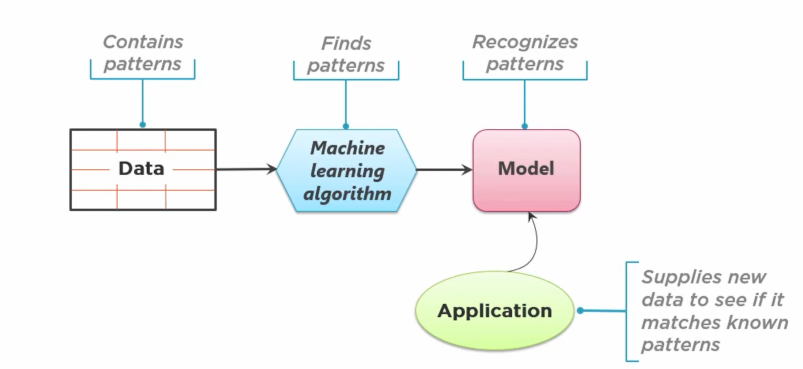

- The model is code

### Why is Machine Learning so Popular?

- Doing machine learning well requires
    - Lots of data
        - We capture more and more data
    - Lots of compute power
        - We have the cloud
    - Effective machine learning algorithms
        - Researches have found what works and what doesn't

### The Ethics of Machine Learning

- What if data is biased?
    - Example: some sort of racial bias in the data will cause that same racial bias to exist in the model
- Models are generated by the machine learning process
    - Uses complex statistical processes
    - Can't just look at it to understand what it does
    - Can be hard to explain why the model is doing what it is doing

## The Machine Learning Process

### Getting Started

- Iterative
- Challenging
    - Can be working with very complex data
- Often rewarding

### Asking the Right Question

- Choosing what question to ask is the most important part of the process
- Do you have the right data to answer this question?
- Do you know how you'll measure success?

### The Machine Learning Process

- Choose data
    - Work a domain expert that knows a lot about credit card fraud
- Once data is ready, you can apply the learning algorithm to the data
- Result of learning algorithm is candidate model
    - Probably isn't the best
    - You produce several
- Deploy chosen model
- Applications can use the model

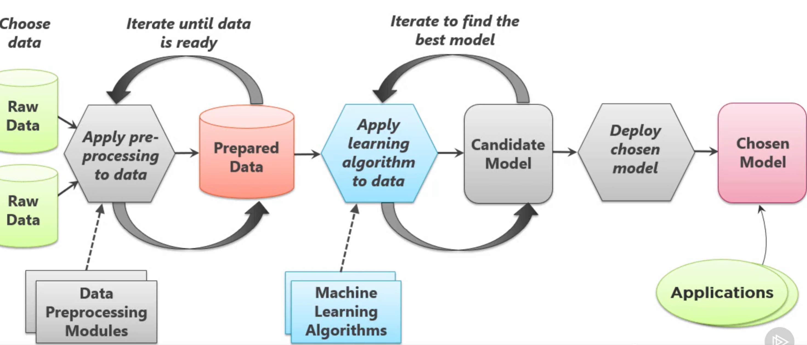

- Have to constantly update model because reality changes

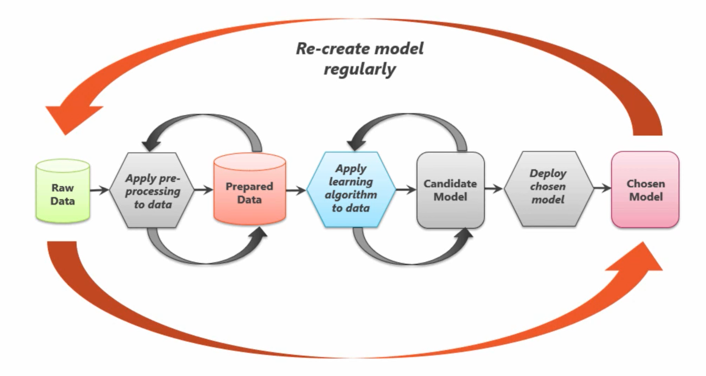

### Examples

**Scenario: Detecting Credit Card Fraud**

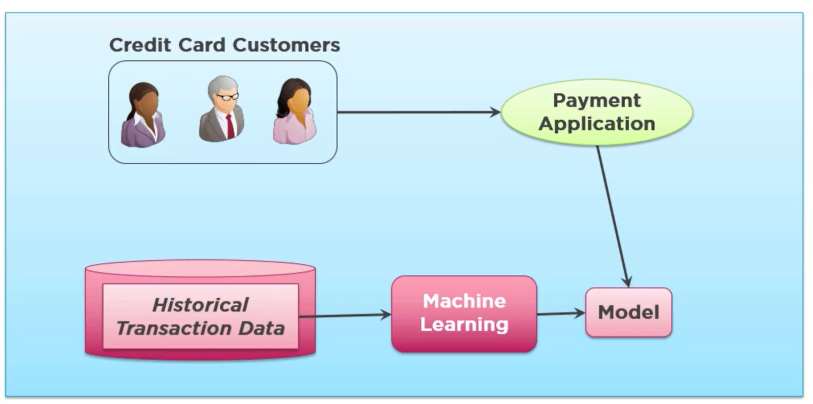

**Scenario: Predicting Customer Churn**

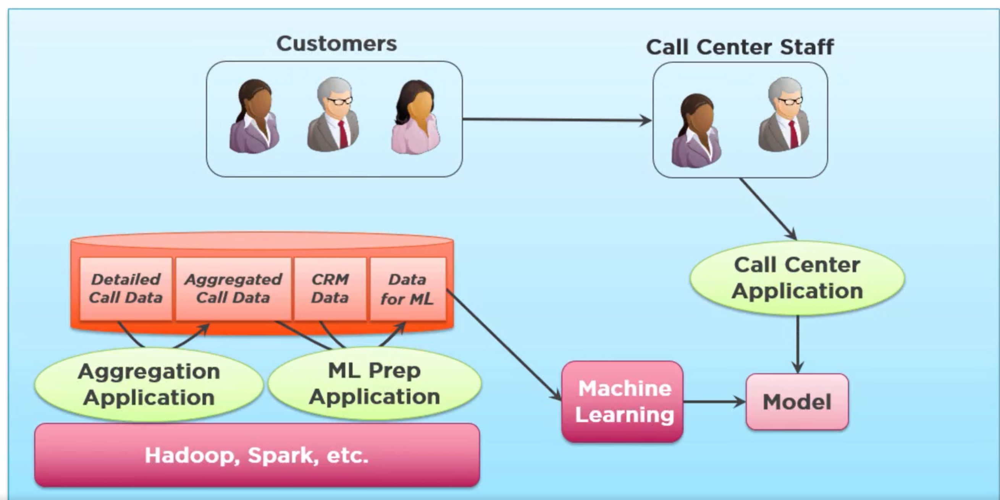

**Common Use Cases**

- Recommandations
    - Think netflix shows
- Speech recognition
- Language translation
- Facial recognition
    - Ethical gray area


## CLoser Look at Machine Learning Process

### Terminology

- Training data
    - Prepared data used to create a model
    - Creating a model is called *training* a model
- Supervised learning
    - The value you want to predict is in the training data
        - In credit card example, whether transaction was fraudalent or not was contained in each record
        - This data is *labeled*
        - More common than unsupervised learning
- Unsupervised learning
    - Value you want to predict is NOT in the training data
    - The data is not labeled

### Data Pre-Processing

- Could be relational, nosql, binary, etc
- Need to read the raw data into some `data preprocessing module(s)`
    - Provided by machine learning 
    - Lots of time spent getting data into right form for the module
- Create training data
    - Columns in `training data`  are called `features`
    - The last row - the `target value` is the value you are trying to predict
        - In the credit card fraud scenario, this would be whether the transaction as fraudalent or not

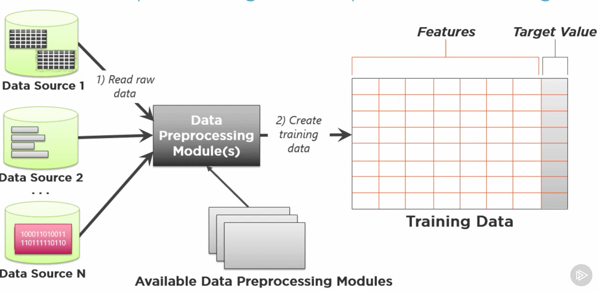

### Categorizing Machine Learning Problems

#### Regression

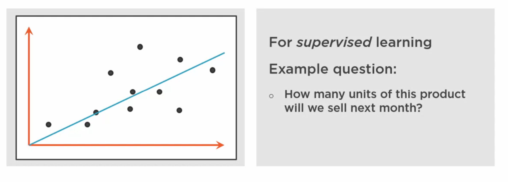

#### Classification

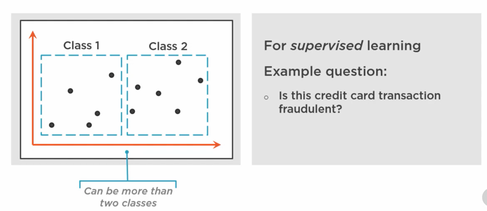

- In our example, classes would be whether the transaction was fraudalent or not
- You get a probability here, not a yes or no

#### Clustering

- We don't necessarily know wha we're looking for

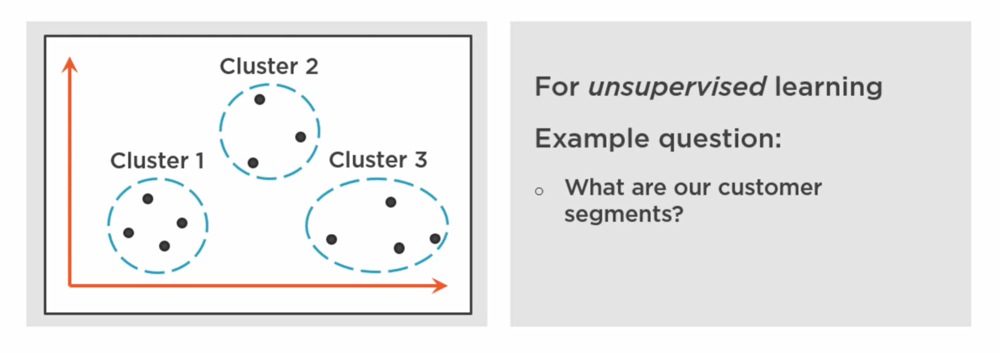

### Styles of Machine Learning Algorithms

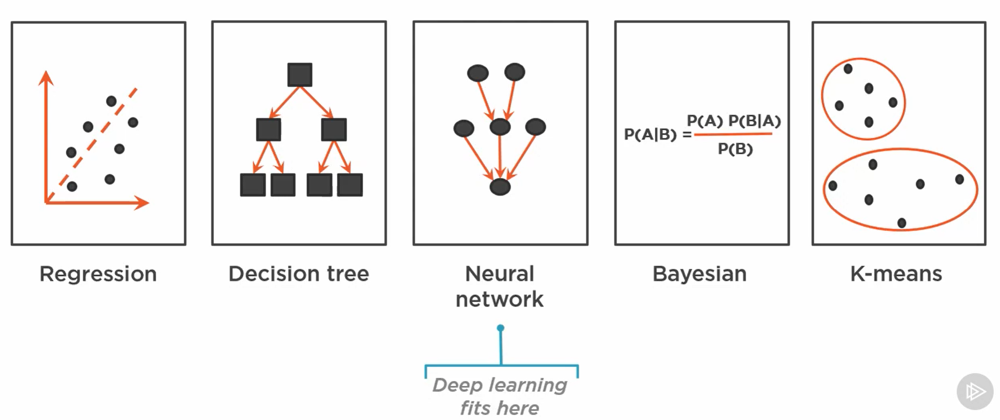

### Training and Testing a Model

- Create training data
- `Target Value` is part of the training data
- Choose the `features` that will be most predicitive of that `target value`
- How do we decide what `features` to use?
    - This is what data scientists are for
- How do we choose the right learning algorithm?
    - This is what data scientists are for

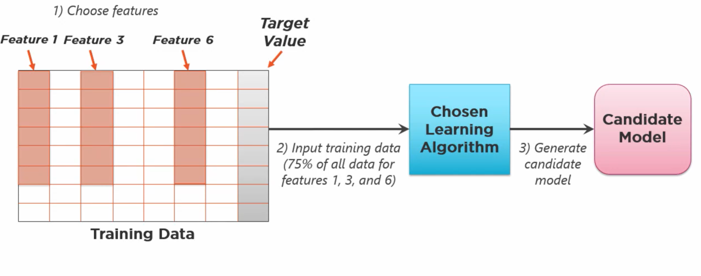

#### Testing a Model

- Input the remaining 25% into candidate model that was created previously

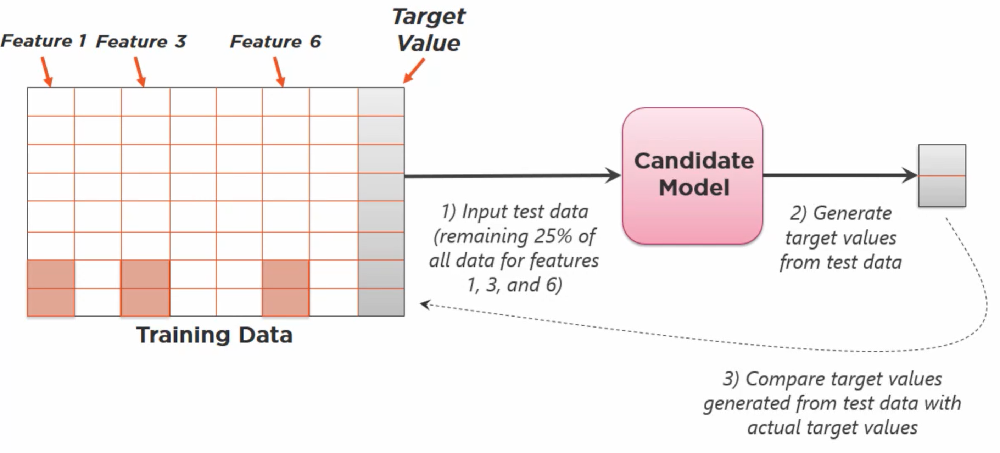

#### Improving a Model: Some Options

- Use different features
- Maybe the wrong dataset 
- Maybe algorithm is wrong
- Modify existing algorithm

### Using a Model

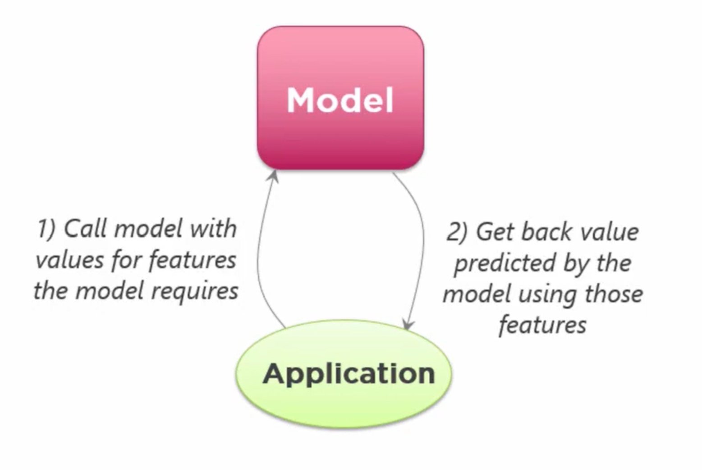

### Implementing Machine Learning

- Create custom models in R and Python using general ML packages
- Create custom models using more focused packages like TensorFlow
- Create custom models using cloud ML services like Amazom SageMaker
- Use predefined models like Azure Cognitive Services
    - Image
    - Speech
    - Recommendations
