# Understanding Machine Learning

## Course

- https://developers.google.com/machine-learning/crash-course
- This course is specifically on supervised machine learning

## Framing

- ML systems learn how to combine input to produce useful predictions on never-before-seen data

### Labels

- *Thing we're predicting* - the `y` variable in simple linear regression.
- Future price of wheat, type of animal in a picture, meaning of an audio clip, etc

### Feature

- Input variable - the `x` variable in simple linear regression
- Email spam detector example
  - Words in the email text
  - Sender's address
  - Time of day the email was sent
  - Email contains the phrase...

### Hyperparameters

- A parameter whose value is set before the learning proces begins
- Model parameters are learned during training, but hyperparameters are configuration variables that govern the training process itself
- Tuning can be done manually, through grid search, random search, or more advanced methods like Bayesian optimization
- Choice and tuning of hyperparameters can significantly affect the performance of a ML model

#### Learning Rate

- Probably most important hyperparamter
- Controls how much the model is adjusted during training with respect to the loss gradient
- Too high a learning rate can cause the model to converge too quickly to a suboptimal point
- Too low a rate can make the training unnecessarily slow

#### Number of Epochs

- Number of times the learning algorithm will work through the entire dataset
- Too few epochs can result in underfitting, while too many can lead to overfitting

#### Batch Size

- In context of mini-batch gradient descent, this refers to the number of training examples used in 1 iteration
- Can affect the model's convergence speed and overall learning dynamics
- One epoch comprises one or more batches (based on batch size)

#### Number of Hidden Layers and Neurons in Neural Networks

- The structure of a neural network (how many layers and how many neurons in each layer) is a key hyperparameter
- Determines complexity and capacity of the model
- A model with more neurons can capture more complex patterns in the data BUT if the model is too complex it can lead to overfitting
  - Overfitting happens when the model learns the noise and details in the training data to an extent that it negatively impacts the performance on new, unseen data
- More neurons means more parameters to train which increases the computational resourecs and time required for training
  - With more neurons the model can become significantly slower to train, and might require more memory and processing power

#### Activation Function

- Functions like ReLU, sigmoid, and tanh determine the output of a neuron given an input or set of inputs
- Different activation functions can drastically change the behavior of a neural network
- Sigmoid is typically used on the output when we have a binary classification problem

#### Regularization Parameters

- Techniques like L1 and L2 regularization are used to prevent overfitting by penalizing large weights
- The strength of the regularization is controlled by hyperparameters

#### Learning Rate Decay

- Rate at which the learning rate decreases over epochs
 
### Gradient Descent

- Helps model find the optimal set of parameters by iteratively adjusting them in the opposite direction of the gradient
  - Optimal set of parameters yields the lowest cost
- The *learning rate* determines the step size take in each iteration which influences the speed and stability of convergence

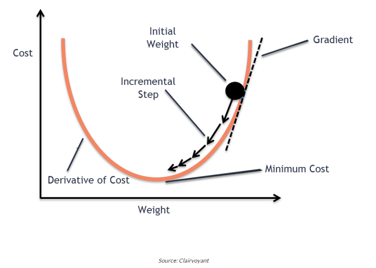

- Gradient descent is an iterative optimization algorithm for finding the local minimum of a function

#### Cost/Loss Function

- Measures the performance of a model for any given data
- **Quantifies the error  between predicted values and expected values and presents it in the form on a single real number**
- You use the Gradient Descent algorithm over the given data
- **Cost Function and Loss Function are often used interchangeably**
  - Loss function is associated with every training example, and the cost function is the average of the loss function over all the data samples

#### Gradient Descent

- Optimization algorithm used in machine learning to minimize the cost function by iteratively adjusting parameters in the direction of the negative gradient, aiming to find the optimal set of parameters

#### Types of Gradient Descent

##### Batch Gradient Descent

- Update's the model's parameters using the gradient of the entire training set
- Calculates the average gradient of the cost function for all training examples and updates the parameters in the opposite direction
- Batch gradient descent gaurantees convergence to a global minimum, but can be computationally expensive and slow for large datasets

##### Stochastic Graident Descent

- Updates the model's parameters using the gradient of one training example at a time
- Randomly selects a training example, computes the gradient of the cost function for that example, and updates the parameters in the opposite direction
- Computationally efficient and can converge faster than batch gradient descent, but it can be noisy and not converge to the global minimum

##### Mini-Batch Gradient Descent

- Updates the model's parameters using the gradient of a small subset of the training data (known as a mini-batch)
- calculates average gradient of the cost function and updates the model's parameters
- Combines advantages of both batch and stochastic gradient descent
- Mostly commonly used method in practice

#### Alpha - The Learning Rate

- Decies the sie of the step we must take along the gradient
- **Must be chosen carefully to choose global minimal and not some local minimal**

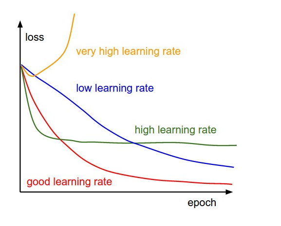

#### Local Minima

- Cost function may consist of many minimum points
- The gradient may settle on any one of the minima whhich depends on the initial point and the learning rate, so the optimization may converge to different points with different starting points and learning rate

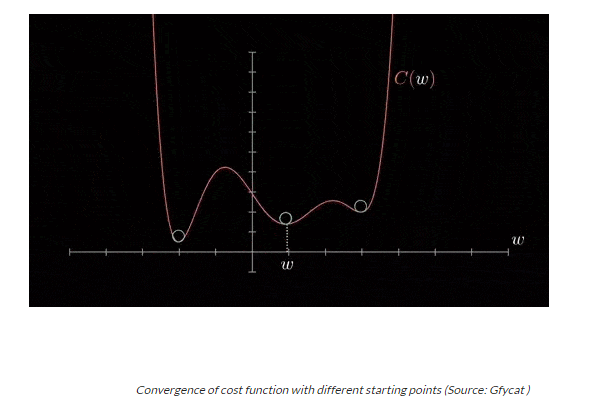

#### Challenges of Gradient Descent

- Local Optima
  - Gradient descent can converge to local optima instead of the global optimum especially if the cost function has multiple peaks and valleys
- Learning Rate selection
  - Can significantly impact the performance of gradient descent
  - If learning rate is too high, the algorithm may overshoot the minimum, and if it is too low, the algorithm may take too long to converge
- Overfitting
  - Gradient descent can overfit the data if the model is too complex or the learning rate is too high
    - Can lead to poor generalization performance on new data
- Convergence Rate
  - Convergence rate of gradient descent can be slow or for large datasets of high-dimensional spaces which can make the algorithm computationally expensive
  - **Improvement stops (or it becomes almost impercetible) after a certain number of epochs**
- Saddle Points
  - Gradient of the cost function can have saddle points which can cause gradient descent to get stuck in a plateau instead of converging to a minimum

#### Types of Cost/Loss Functions

- Mean Squared Error (MSE)
- Cross-Entropy Loss (Log Loss)
- Mean Absolute Error (MAE)
- Hinge Loss
- Binary Cross-Entropy
- Categorial Cross-Entropy
- Huber Loss
- Kullbacker-Leibler Divergence
- Cosine Similarity
- Focal Loss

##### Binary Cross Entropy

- Used to measure the performance of a classification model whose output is a probability between 0 and 1
- Also called logarithmic loss or log loss
- Metric used to evaluate models by measuring the extent of incorrect labeling of data classes
- Penalizes the model for deviations in probability that result in misclassification of the labels
- When the log loss value is low, it indicates a high level of accuracy in the model's predictions

--------
**Intuitive Explanation**

- Imagine you're a teacher grading a true/false quiz
- For each question, a student either gets it right or wrong, but they also tell you how confident they are in their answer
- The **true/false answers** represent whether actual classes (0 or 1) in your binary classification problem
- The **student's confidence** level represents the predicted probability between (0 and 1) that a given class label is the correct one

 

**Key Concepts**

- **Accuracy vs Confidence**
  - it's not just about whether the student (aka your modeL) gets the answer right or wrong, but also about how confident they are in their answer
- **Penalizaing Overconfidence and Underconfidence**
  - If a student is very confident (say 90% sure) but gets the answer wrong, they should be penalized more heavily because their high confidence was misleading
  - If a student is very confident and correct, they should be rewarded more than if they were not confident in their correct answer
- **Calculating the "Grade" (Loss)**
  - For each question (data point), you assess the student's performance based on their confidence and whether they got it right or wrong
  - A perfect score is achieved when the student is 100% confident and correct, resulting in no penalty (zero loss)
  - The worst score is when a student is 100% confident but completely wrong, resulting in a heavy penalty (high loss)
- **Averaging the Scores**
  - At the end of the quiz, you average all the scores for all the questions to get the overall performance (the average loss across all data points)

 

**In the Context of Machine Learning**

- When your model predicts a data point, it says, *I am X% sure this point belongs to class 1*
- Binary Cross-Entropy is like your grading scheme
  - It penalizes the model for being confident and wrong but rewards it for being confident and right
- Goal in training the model is to minimize this penalty (loss) across all data points, making the model not only accurate but also appropriately confident in its predictions

### Representation

#### Feature Engineering

- Process of extracting features from raw data
- Definition of a feature shouldn't change over time
- Features should not have extreme outliers
  - Filter out these outliers

##### Mapping Categorical Values

- Imagine that there is a feature with options that include
  - `{'Charleston Road', 'North Shoreline Boulevard', 'Shorebird Way', 'Rengstorff Avenue'}`
  - Since models cannot multiply strings by the learned weights, we convert these strings to numeric values
- We can accomplish this by defining a map from the feature values, this is called the **vocabulary** of possible values, to integers
- Since not every street in the world will appear in our dataset, we can group all other streets into a catch-all "other" category know as an **OOV (out-of-vocabulary) bucket**
- Using this approach, here's how we can map our street names to numbers:
  -  charleston road = 0
  -  north shoreline boulevard = 1
  -  shorebird way = 2
  -  rengstorff avenue = 3
  -  everything else = 4

###### One Hot Encoding

- BQ ML uses *one hot encoding* by default
  - https://cloud.google.com/bigquery/docs/reference/standard-sql/bigqueryml-syntax-create-glm#category_encoding_method
  - Talks about feature transformations here: https://cloud.google.com/bigquery/docs/auto-preprocessing#one_hot_encoding
- One-hot encoding
  - https://developers.google.com/machine-learning/glossary/#one-hot-encoding
  - Represents categorical data as a vector
    - One element is set to 1
    - All other elements are set to 0
  - Commonly used to represent strings or identifiers that have a finite set of possible values

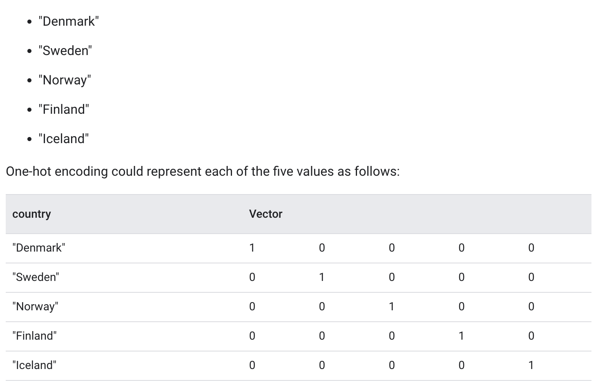

- Spare representation
  - Suppose you had 1M different street names in your data set that you wanted to include as values for a particular feature, explicitly creating a binary vector of 1M elements where only 1 or 2 elements are true is a very inefficient representation in terms of both storage and coputation time when processing these vectors
  - In this case,common approach is to use a sparse representation in which only nonzero values are stored
  - https://cloud.google.com/blog/topics/developers-practitioners/sparse-features-support-in-bigquery

### Feature Crosses

#### Encoding Nonlinearity

- Rarely used in neural networks

### Classification

- Is something A or B
- There are multiple metrics to evaluate classification models

#### Evaluation Metrics: Accuracy

- Fraction of predictions we got right
  - All things that were predicted correctly divided by everything
  - `(true_positives + true_negatives)/(true_positives + true_negatives + false_positives + false_negatives)`
- In many cases, accuracy is a poor or misleading metric
  - Typical case includeds *class imbalance*, when positives or negatives are extremely rare
    - Imagine an ad click through rate and all of your features are "false" indicating that it wasn't clicked - model would only produce false
  - Imagine model accuracy is 99.99% accurate, but what you really care about is finding out the .01% of ads that are succcessful

##### Class-imbalanced Data Set

- Watch out for a **class-imbalanced data set**
- A dataset for a classification problem in which the total number of labels of each class differs significantly
- For example consider a binary classification whose two labels are divided as follows
  - 1,000,000 negative labels
  - 10 positive labels
  - The ratio of negative to positive labels is 100,000:1, so this is a class-imbalanced dataset
- Imagine another dataset where there is not a class-imbaalnced
  - 517 negative labels
  - 483 positive labels
  - The ratio of negative labels to positive labels is roughly 1
- This same problem can exist with mutli-class datasets

#### True Positives and False Positives

- For class imbalanced problems, useful to separate out different kinds of errors

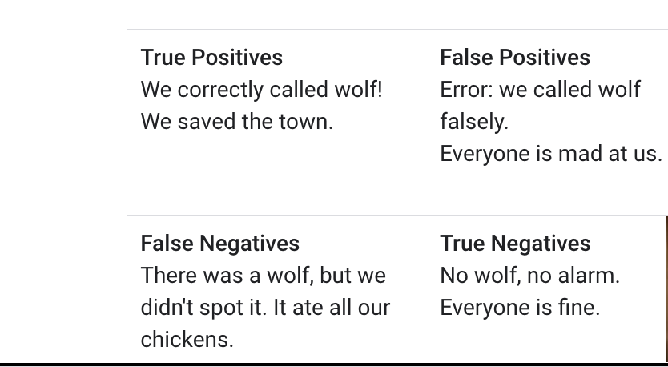

#### Evaluation Metrics: Precision and Recall

- Precision
  - *What proportion of positive identifications was actually correct?*
  - `true positives / all positive predictions` = `true_positives/(true_positives + false_positives)`
    - When a model said "positive" class, was it right
    - Did the model cry "wolf" too often?
- Recall
  - *What proportion of actual positives was identified correctly*
  - `true positives / all actual positives` = `true_positives/(true_positives + false_negatives)`
    - Out of all possible positives, how many did the model correctly identify?
    - Did it miss any wolves?
- These two metrics can be in contention
  - If you want to be better at recall, you're going to be more aggressive about saying wolf (lowering the classification threshold)
    - Typically raises it, doesn't always
  - If you want to be more precise, you'll only say wolf when you're absolutely sure (raising the classification threshold)
    - Typically raises it, doesn't always
  - Good illustration of this - https://developers.google.com/machine-learning/crash-course/classification/precision-and-recall
  - Good quiz: https://developers.google.com/machine-learning/crash-course/classification/check-your-understanding-accuracy-precision-recall
- Both of these values are very important in model evaluation

#### ROC Curve

- ROC = receiver operating characteristic
- Imagine that you don't know the best classification threshold is going to be, still want to know if model is doing a good job
- We might want to evaluate our model across all possible classification thresholds
- It's a graph showing the performance of a classification model at all classification thresholds

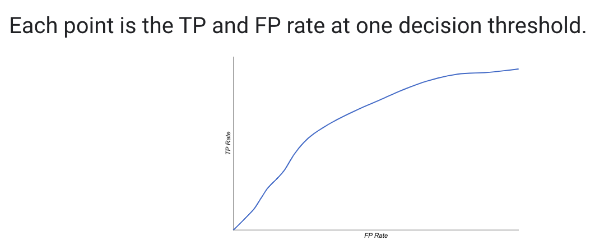

- Curve plots two parameters
- **True Positive Rate (TPR)**
  - `true_positive_rate = (true_positive / (true_positive + false_negative))`
- **False Positive Rate (FPR)**
  - `false_positive_rate = (false_positive / (false_positive + true_negative))`
- An ROC curve plots TPR vs FPR at different classification thresholds
  - Lowering the classification threshold classifies more items as positive which increases both False Positives and True Positives

  
##### AUC

- AUC = area under the ROC curve
- Measures the 2D area underneath the entire ROC curve (integral calculus) from (0, 0) to (1, 1)
- If we pick a random positive and a random negative, what's the probability the model ranks them in the correct order - higher score to the positive and lower score to the negative
- Gives an aggregate measure of performance aggregated across all possible classification thresholds

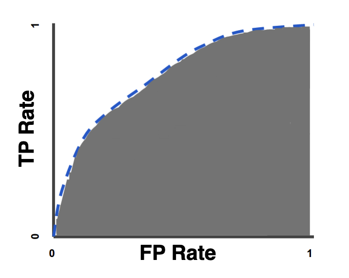

- Provides an aggregate measure of performance across all possible classification thresholds
- One way of interpreting AUC is as the probability that the model ranks a random positive example more highly than a random negative example

- AUC represents the probability that a random positive (green) example is positioned to the right of a random negative (red) example
- AUC ranges in value from 0 to 1
  - A model whose predictions are 100% wrong has an AUC of 0.0, and one whose predictions are 100% correct has an AUC of 1.0
- AUC is desirable for 2 reasons
  - AUC is **scale-invariant** - measures how well predictions are ranked; rather than their absolute values
  - AUC is **classification-threshold-invariant** - measures quality of the model's predictions irrespective of what classification threshold is chosen
- Both these reasons come with caveats
  - **Scale invariance is not always desireable**
    - For example, sometimes we really do need well calibrated probability outputs, and AUC won't tell us about that
  - **Classification-threshold invariance is not always desireable**
    - In cases where there are wide disparities in the cost of false negatives vs false positives, it may be critical to minimize one type of classification error
      - For example, when doing email spam detection, you likely want to prioritize minimize false positive (een if that results in a significant increase of false negatives)
      - AOC isn't a useful metric for this type of  optimization

#### Prediction Bias

- Expected value should be actual
- If there is deviation, then we say the model has a *bias*
- Useful to know when there is something wrong with the model
  - Incomplete feature set, buggly pipeline, biases training sample
  - Having a bias of 0 doesn't necessarily mean our model is accurate
  - Look for bias in slices of data - this can guide improvements
- Example, if 1% of all emails are spam, then our model should predict, on average, that emails are 1% likely to be span

##### Bucketing and Prediction Bias

- Logistic regression predicts a value *between* 0 and 1, but all labeled examples are either exactly 0 or exactly 1
- This means when examining prediction bias, you cannot accurately determine the prediction bias on only 1 example
  - Need to examine the prediction bias on a "bucket" of examples
  - Predictin bias only makes sense when grouping enough examples together to be able to compare to a predicted value (for example, 0.392) to observed values (for example, 0.394)

#### Calibration Plots Show Bucketed Bias

#### Classification: Thresholding

- Logistic regression returns a probability - you can use the probability "as is" (for example, probability that the user will click on this ad is 0.00023) or convert the returned probability to a binary value
- A logistic regression model that returns 0.9995 for a particular email mesage is predicting that it is very likely to be spam
- In order to map a logisitic regression to a binary category, you must define a **classification threshold** (aka **decision threshold**)
  - If your example is defining whether an email is spam or not, above this threshold indicates spam, and a value below indicates not spam
- *Tuning* a threshold is different than tuning hyperparameters such as learning rate
  - Part of choosing a threshold is assessing how much you'll suffer for making a mistake
    - For example, labeling a non-spam message as spam is very bad, but labeling spam as non-spam is annyoing, but not impactful

#### Confusion Matrix

- It's a table that summarizes the number of correct and incorrect predictions that a classification model made
- **Ground truth** is the thing that actually happened - it's reality
  - For example consider a binary classification model that predicts whether a student in their first year of univesity will graduate within 6 years. Ground truth for this model is whether or no that student actually graduated within 6 years

- Example is with crying wolf

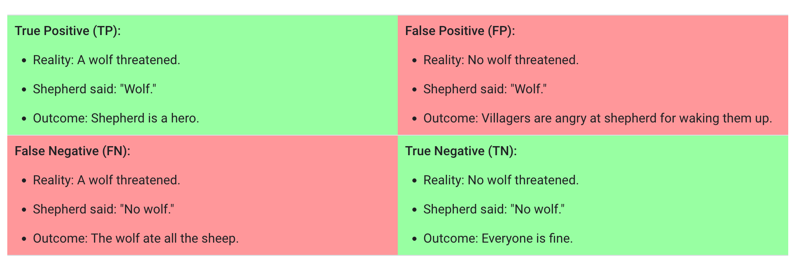

- A **true positive** is an outcome where the model *correctly* predicts the *positive* class
- A **true negative** is an outcome where the model *correctly* predicts the *negative* class
- A **false positive** is an outcome where the model *incorrectly* predicts the *positive* class
- A **false negative** is an outcome where the model *incorrectly* predicts the *negative* class

#### Accuracy

### Regularization

- Technique used to prevent overfitting of a model on the training data, which can negatively impact the model's performance on new, unseen data
- Overfitting occurs when a model learns the detail and noise in the training data to the extent that it negatively impacts the performance of the model on a new data
- Regularization addresses this by adding a penalty to the loss function used to train the model

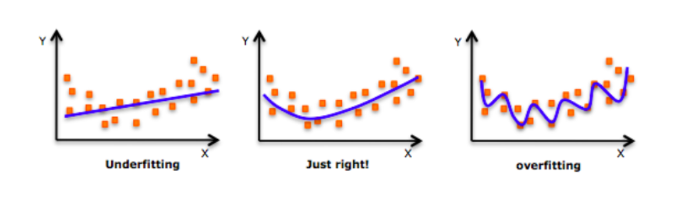

- As we move towards the right in this image, our model tries to learn *too* well the details and the noise from the training data which ultimately results in poor performance on the unseen data

- In ML, regularization penalizes the coefficients
- In deep learning, regularization penalizes the weight matrices of the nodes

#### Different Regularization Techniques in Deep Learning

##### L1 & L2 Regularization

- L1 Regularization = Lasso Regularization
- L2 = Ridge Regularization
- Most common types
- Update the general cost function by adding another term knows as the regularization
- *Cost function = Loss(binary cross entropy) + Regularization term*

---------
**L1 Regularization**

- Imagine you're an artist and you're asked to draw a landscape using a limited number of colors
- You decide to only use the colors that are absolutely necessary to capture the essence of the landscape
- This is similar to what L1 regularization does in machine learning
- **How it works**
  - L1 regularization adds the absolute values of the coefficients to the loss function - this is like saying *I want to keep my model simple by using as few features (colors from the artist example) as possible*
- **Effect**
  - Tends to zero out the less important features' coefficients effectively removing them from the model (like deciding not to use certain colors in your drawing)
    - This results in a sparse model where only the most significant features are used
- Like being selective with your colors in a drawing, picking only the essential ones and ignoring the others
---------

---------
**L2 Regularization**
- Imagine you're asked to paint the same landscape but with a twist: you can use all your colors, but you must use them in such a way that no single color dominates the paintining
- This is akin to L2 regularization
- **How it works**
  - L2 adds the square of the coefficient values to the loss function - this is like saying *I want to use all my features (colors), but I want to balance their contributions so no single feature (color) is overwhelming*
- **Effect**
  - Doesn't eliminate any features (colors) completely like L1 does
  - Reduces impact of less important features and helps to keep the model coefficients (color intensities) moderate, preventing any one feature from having too much influence on the model

#### Dropout

- Produces very good results and is consequently the most frequently used regularization technique in the field of deep learning
- Let's say neural network looks like the below

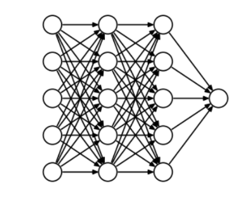

- At every iteration, dropout randomly selects some nodes and removes them along with all of their incoming and outgoing connections

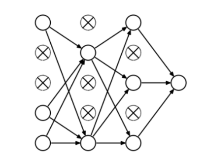

- Each iteration has a different set of nodes and this results in a different set of output
- The probability of choosing how many nodes should be dropped is a hyperparameter of the dropout function
- Dropout can be applied to both the hidden layers as well as the input layers
- Dropout is usualy preferred when we have a large neural network in order to introduce more randomness

## Course

- https://app.pluralsight.com/library/courses/understanding-machine-learning

## What Is Machine Learning

### Getting Started

- Finds patterns in data
- Uses those patterns to predict the future
- Examples:
    - Detect credit card fraud
    - Determine whether a customer is likely to switch to a competitor
    - Deciding when to do preventive maintenance on a factory robot

**What does it mean to learn?**

- Learning requires:
    - identifying patterns
    - recognizing those patterns when you see them again
- This is what machine learning does

### Machine Learning in a Nutshell

- The model is code

### Why is Machine Learning so Popular?

- Doing machine learning well requires
    - Lots of data
        - We capture more and more data
    - Lots of compute power
        - We have the cloud
    - Effective machine learning algorithms
        - Researches have found what works and what doesn't

### The Ethics of Machine Learning

- What if data is biased?
    - Example: some sort of racial bias in the data will cause that same racial bias to exist in the model
- Models are generated by the machine learning process
    - Uses complex statistical processes
    - Can't just look at it to understand what it does
    - Can be hard to explain why the model is doing what it is doing

## The Machine Learning Process

### Getting Started

- Iterative
- Challenging
    - Can be working with very complex data
- Often rewarding

### Asking the Right Question

- Choosing what question to ask is the most important part of the process
- Do you have the right data to answer this question?
- Do you know how you'll measure success?

### The Machine Learning Process

- Choose data
    - Work a domain expert that knows a lot about credit card fraud
- Once data is ready, you can apply the learning algorithm to the data
- Result of learning algorithm is candidate model
    - Probably isn't the best
    - You produce several
- Deploy chosen model
- Applications can use the model

- Have to constantly update model because reality changes

### Examples

**Scenario: Detecting Credit Card Fraud**

**Scenario: Predicting Customer Churn**

**Common Use Cases**

- Recommandations
    - Think netflix shows
- Speech recognition
- Language translation
- Facial recognition
    - Ethical gray area

## Closer Look at Machine Learning Process

### Terminology

- **Training data**
    - Prepared data used to create a model
    - Creating a model is called *training* a model
- **Supervised learning**
    - The value you want to predict is in the training data
        - In credit card example, whether transaction was fraudalent or not was contained in each record
        - This data is *labeled*
        - More common than unsupervised learning
- **Unsupervised learning**
    - Value you want to predict is NOT in the training data
    - The data is not labeled

#### Epochs

- During an epoch, every sample in the training data is presented to the model exactly once - this means that if you have 1000 samples, each of those samples will be used for training the model during the epoch
- **Learning Process** The model learns by adjusting its weight based on the error of its predictions compared to the actual outcomes
  - In supervised learning, this is typically done using a method called backpropagation
- **Multiple Epochs in Training** Training a machine learning model involves multiple epochs
  - Going through the data once is often not enough for the model to learn effectively
  - By repeatedly going through the dataset, the model has a cahnce to refine its weight  and biases to minimize error
- **Balancing Epochs** The number of epochs is an important *hyperparameter* in training a machine learning model
  - Too few epochs can lead to underfitting, where the model does not learn enough from the data
  - Too many epochs can lead to overfitting, where the model starts to learn the noise in the training data as if it were a meaningful input
- **Epochs and Batch Size** In large datasets, each epoch is often divided into smaller batches of data
  - Processing the entire dataset at once can be computationally expensive and impractical
  - Model's weights are updated after each batch, and one epoch is completed when all batches have been processed
  - If you have 1000 samples and a *batch_size* of 100, it takes 10 iterations (batches) to complete one epoch
- Useful to measure how our metrics (like accuracy) increases on training and test sets when number of epochs increases

### Data Pre-Processing

- Could be relational, nosql, binary, etc
- Need to read the raw data into some `data preprocessing module(s)`
    - Provided by machine learning 
    - Lots of time spent getting data into right form for the module
- Create training data
    - Columns in `training data`  are called `features`
    - The last row - the `target value` is the value you are trying to predict
        - In the credit card fraud scenario, this would be whether the transaction as fraudalent or not

### Categorizing Machine Learning Problems

#### Regression

#### Classification

- In our example, classes would be whether the transaction was fraudalent or not
- You get a probability here, not a yes or no

#### Clustering

- We don't necessarily know wha we're looking for

### Styles of Machine Learning Algorithms

### Training and Testing a Model

- Create training data
- `Target Value` is part of the training data
- Choose the `features` that will be most predicitive of that `target value`
- How do we decide what `features` to use?
    - This is what data scientists are for
- How do we choose the right learning algorithm?
    - This is what data scientists are for

#### Testing a Model

- Input the remaining 25% into candidate model that was created previously

#### Improving a Model: Some Options

- Use different features
- Maybe the wrong dataset 
- Maybe algorithm is wrong
- Modify existing algorithm

### Using a Model

### Implementing Machine Learning

- Create custom models in R and Python using general ML packages
- Create custom models using more focused packages like TensorFlow
- Create custom models using cloud ML services like Amazom SageMaker
- Use predefined models like Azure Cognitive Services
    - Image
    - Speech
    - Recommendations

## Deep Learning

### Activation Functions

- Used to introduce non-linearity into the model
- This is important to model complex relationships - within our data there are likely non-linear relationships
- Where they are used depends on the type of algorithm
  - For example, in multiclass classification, activation functions are used in the hidden layers (using something like ReLU function) and output layers (like Softmax function)
  

#### Binary Classification

- Activation function is used to help decide whether the output is yes/no or true/false
- Activation functions are used in both the hidden layers and the output layers

##### Hidden Layers

- Common choices include Rectified Linear Unit(ReLU) and its variants like Leaky ReLU, Parametric ReLU, and Exponential Linear Unit

##### Output Layer

- Most common activation function in the output layer is particularly important as it converts the final layer's output into a format suitable for classification
- Most common choice is sigmoid function - maps output to probability score between 0 and 1

### Neural Networks

#### Binary Classification

## AutoML

- Ideally you want to provide esaily accessible deep learning tools to domain experts w/o requiring a strong machine learning background
  - Problem is that it is not easy to explain to the users of your model why a *particular* composition of a model works
    - For example, with breast cancer detection via X-ray, why does one CNN work better than another?
- It is not easy to understand whether or not there are different compositions of the manually crafted model that can achieve better results
  - Ideally you want to provide deep learning tools for exploring the space of variants (for example, different compositions) in a more principled and automatic way
- Central idea of AutoML is to reduce the steep learning curve and the huge costs of handcrafting machine learning solutions by making the whole end-to-end machine learning pipeline more automated
- The AutoML pipeline consists of 3 macro steps
  - data preparation
  - feature engineering
  - automatic model generation

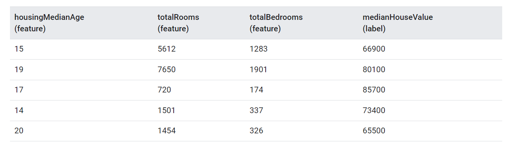

## General Terminology

### Coefficients

- Term *coefficient* refers to the weights assigned to each feature (or input variable) in the model
- Imagine a model represented by equation `y = B0 + B1*X1 + B2*X2 + .... + BN*XN`
- B0 is the intercept and B1, B2, BN are the coefficients
- Coefficients can be seen as a measure of feature importance
- A feature with very low or zero coefficient has little to no influence on the model's predictions

