# Neural Networks Deep Learning

https://www.coursera.org/learn/neural-networks-deep-learning

## What is a Neural Network

- Have to give `x` to the model as input and the neurons will figure out the middle part
  - They'll figure out that family size, walk-ability, and school quality are important factors 
    in the price of the out
- In your training set you would give a number of examples with `x` and `y`

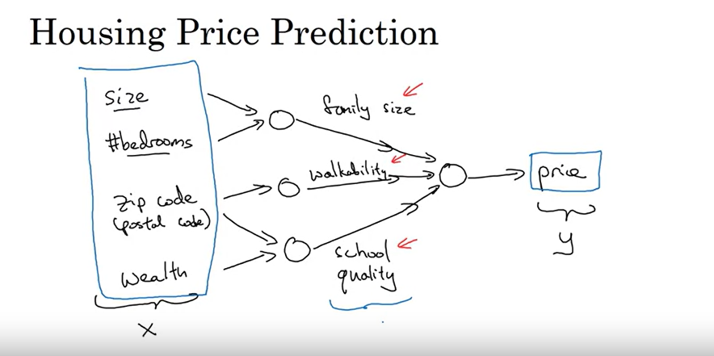

- Each `input feature` is applied to every node in the **hidden layer**
- So x1 is applied to all 3 nodes in the hidden layer and the neural network decides what is 
  unrelated and what is related

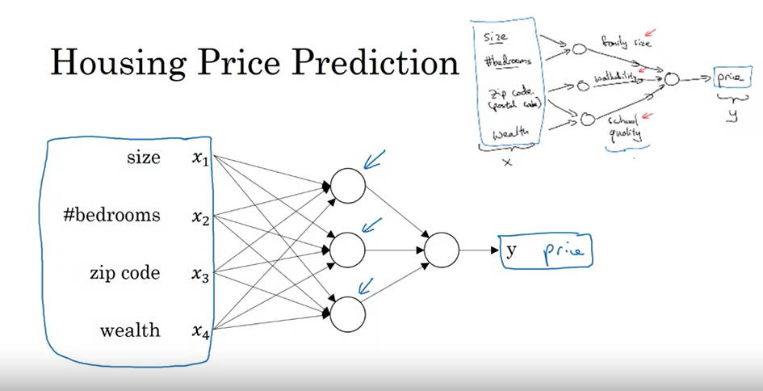

- **Supervised learning**
  - Train model on a certain set of data

## Supervised Learning with Neural Networks

- Most value is in one type of machine learning called *supervised learning*
- You have some input `x` and you want some function that maps to output `y`
  - Neural networks will create that function for you


- Different neural networks architectures work better for different applications
  - Image data you often use CNN
    - Convolutional Neural Network
  - For sequence data you often use RNN
    - Recurrent Neural Network
    - Think of audio, audio is an example of time series/sequenced data
  - For more complicated scenarios like autonomous driving, you might have some sort of custom 
    neural network

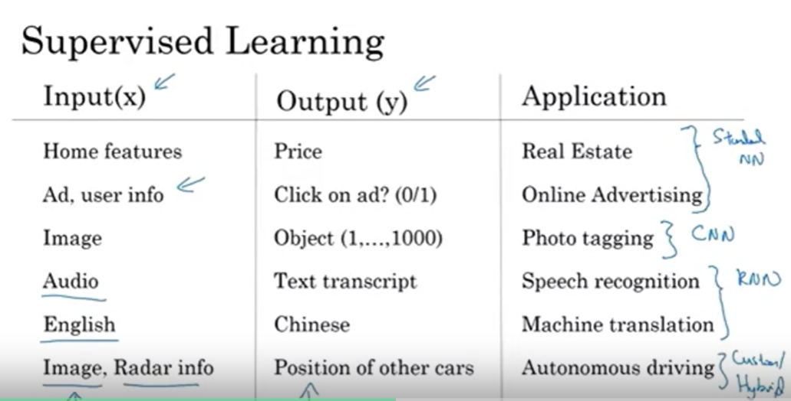

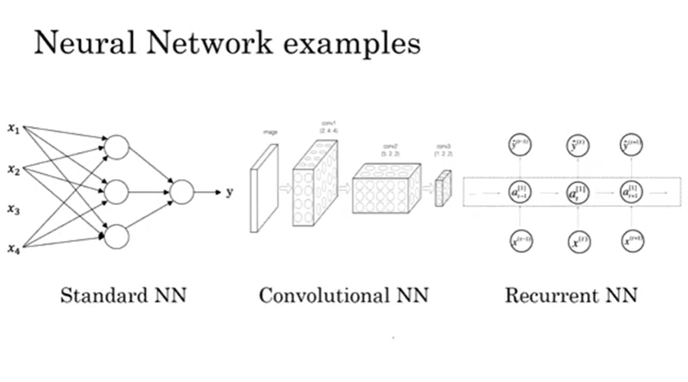

### Structured vs Unstructured

- Structured data is like database data where you may have a column designated to each feature
- Unstructured data examples are audio, image, text
  - Pixel values, individual works on a piece of paper, etc
  - Harder for computers to make sense of this
  - Thanks to deep learning, computers are much better at interpreting this

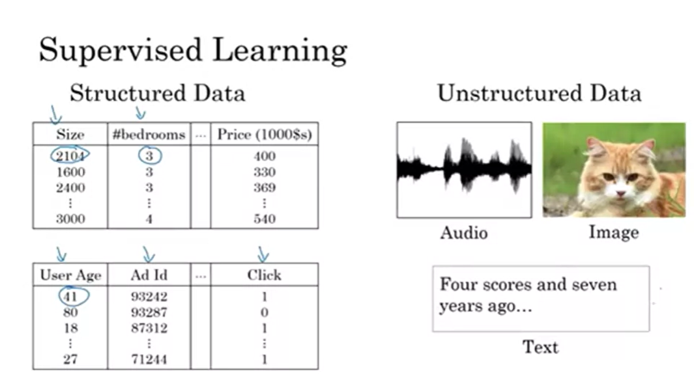

## Why is Deep Learning taking off?

- Ideas have been around for decades
- For traditional ML algorithms (sum, logistic regression, etc), performance of the model 
  improves as labeled data is added but quickly plateaus

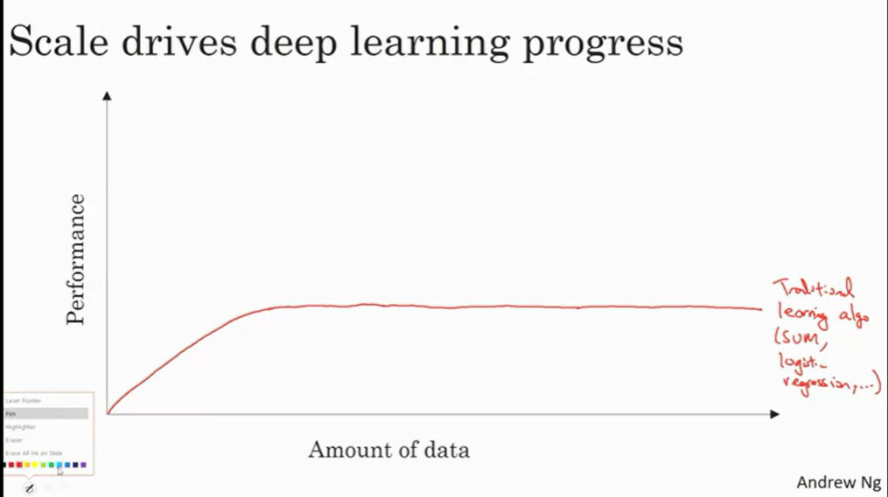

- More recently, we have started having large amounts of **labeled** data where before data was 
  much more 
  limited
- To get the most of our a neural network, you need a lot of **labeled** data
  - Scale has been driving the success of neural networks
- Note in the below that `m` is the size of the training data set


- We also have much more compute power (much larger and more powerful CPUs and GPUs)
- Lots of algorithmic innovation in the last few years
  - A lot of innovation here has been around making NNs run faster
- One of the big breakthroughs was switching from the **activation function** from a `sigmoid` 
  function to the `RELU` function
  - One of the problems with the sigmoid function is that at the ends of the function, the 
    gradient is very small so learning becomes very slow
  - Makes **gradient descent** work much faster
- Algorithm change can change the computation performance

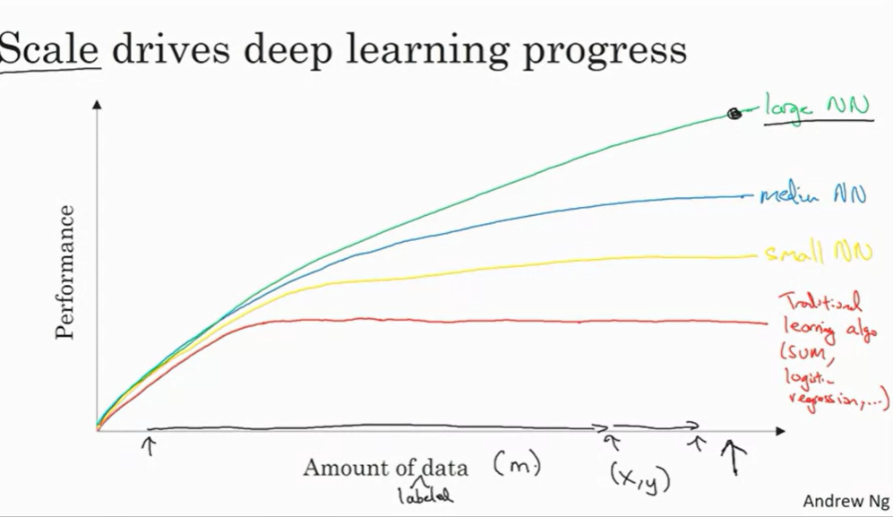

- Training a neural network is very iterative
- You create a version, experiment, make tweaks, experiment, etc
- When computation is faster, you can iterate faster

## Logistic Regression as a Neural Network

### Binary Classification

- Logistic regression is an algorithm for binary classification

<br>

- Notation link: https://d3c33hcgiwev3.cloudfront.net/_106ac679d8102f2bee614cc67e9e5212_deep-learning-notation.pdf?Expires=1701734400&Signature=LpvUH5OoHSWp5cQ2lFncPeE6c887AsFYFiEShkiCyCICQhVZpT8c~mUEsJctwRX1g9RfsPJkN-X7bW-LFmnEMZ-i5jewRm7ZaeC9ML6nDB5FGEcakHsb4-LSoO6pXkFMd3zMwecS-QabqFMgHT3-sLMpoYkXjsgjoOWg6GXgliA_&Key-Pair-Id=APKAJLTNE6QMUY6HBC5A
- A single training example is represented by `(x, y)`
- X is an x-dimensional feature vector
- Y, the label, is either 0 or 1

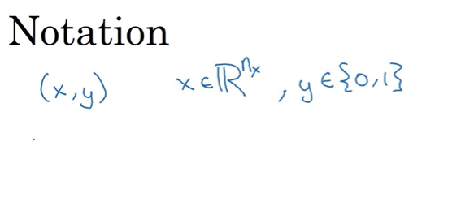

- m training examples
- Lowercase m denotes number of training examples
  - m<sub>train</sub> = # of training examples
  - m<sub>test</sub> = # of test examples

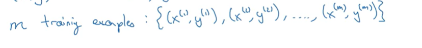

- For a more compact notation, we have matrix `X`
- Matrix will have `m` columns (number of training examples)
- Height is n<sub>x</sub>

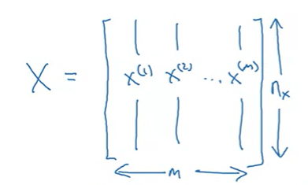

- To denote `Y`, we will have a `1 x m` matrix

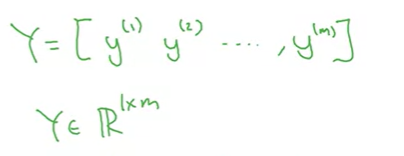

### Logistic Regression

- This is the algorithm you use when the output is either 0 or 1
  - Is an image a cat or not
- Given `x`, want `y_hat = P(y = 1 | x)` 
  - Probability that y = 1 given the input features `X`
- W is an X dimensional vector
  - Weight vector represents the weights or coefficients associated with each feature in the 
    input feature vector
  - If there are *n* features in the input vector, then **W** is a vector of length *n*
  - The absolute value of each weight indicates the strength of the association between the 
    corresponding feature and the output
    - Larger absolute values imply a stronger influence
- b which is a real number
  - **Bias term**
  - Allows model to have flexibility in terms of the baseline or intercept
  - If *b* is positive, it tends to push the prediction towards the positive class
  - If *b* is negative, it tends to push the prediction towards the negative class

### Logistic Regression Cost Function

- Loss function helps us determine how well our function is doing
  - Measure how good `y_hat` is as compared to expected output `y`
- In Logistic Regression, most typically the `binary cross-entropy loss` function is used
  - Also known as `logistic loss` or `log loss`
- Loss function wants to make `y_hat` as small as possible
- Loss function measures against a single training example

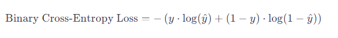

- Cost function measures how well you are doing on the *entire* training set
  - Measures *W* and *b* specifically
- Want to try and find parameters W and b that minimize overall cost function

### Gradient Descent

- Want to find parameters *W* and *b* that minimize the cost function `J(w, b)`
- Repeatedly take value of *w* and update it until algorithms converges to global minimal of the 
  function
- There is a `learning rate`, `alpha` here that controls how big of a "step" we take during our 
  descent

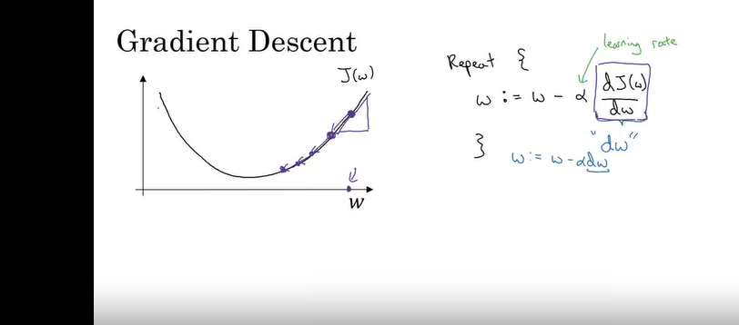

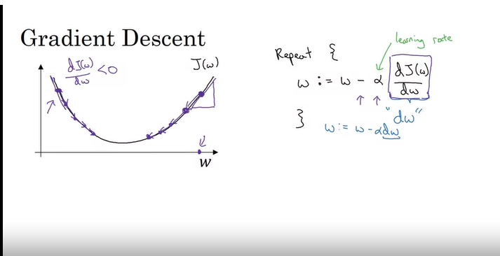

- In reality, you have to update the cost function for both *w* and *b*, so we do this for both 
  of those parameters

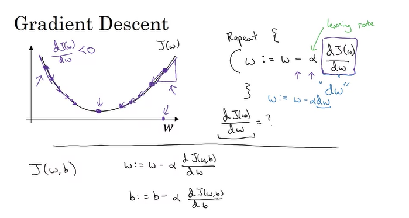

### Computation Graph

- Computation graph is a directed acyclic graph (DAG)
- Plays a critical role in backpropagation
- During backpropagation, gradients are computed with respect to the parameters of the model
- Computation graph helps in efficiently calculating these gradients by propagating them 
  backwards through the graph

#### Simple example

- `z = (x + y) * w`
- Input nodes = x, y, and w
- Operation Nodes:
  - Node A: Addition (Add *x* and *y*)
  - Node B: Multiplication (Multiply the result of Node A by *w*)
- Output Node:
  - Node C: Output node representing the final result *z*

```
      x    y    w
       \  /      \
        A         B
         \         /
          \       /
           \     /
            \   /
             \ /
              C
               \
                z
```

### Derivatives with a Computation Graph

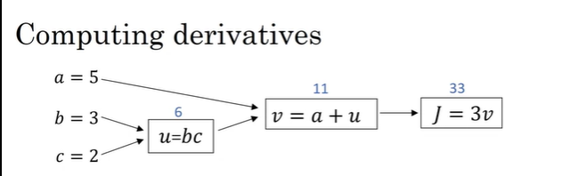

### Vectorization

- Removing for loops from code
- Traditionally, you might loop through all the weights and all features, multiply these 
  together and add the bias
- Important to improve training times
- GPUs are better are parallelized computations, but CPUs are also good 

```
# Without Vectorization
result = []
for i in range(len(array)):
    result.append(array[i] * 2)
```

```
# With Vectorization (using NumPy)
result = array * 2
```

- Vectorization is a fundamental concept in high-performance computing and is widely used in 
  scientific computing, machine learning, and data analysis to achieve efficient and scalable 
  computations

## Shallow Neural Networks 

### Neural Networks Representation

- During training, we provide the features to the input layer and we provide the output value
  - The hidden layer is not provided during training, so hidden here just means that you don't 
    see it in the training set

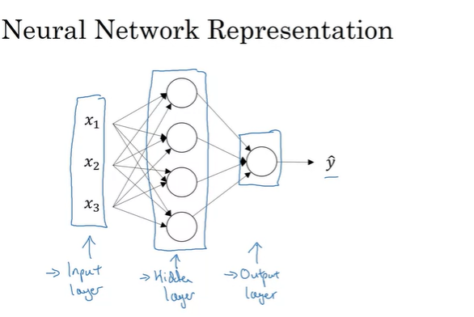

- X can also be denoted as a<sup>[0]</sup>
- `a` means activation here
  - This refers to the values that a layer passes on to another layer
  - The *activations* to the input layer are a<sup>[0]</sup>
- In our example, the input layer passes on `x` to the hidden layer

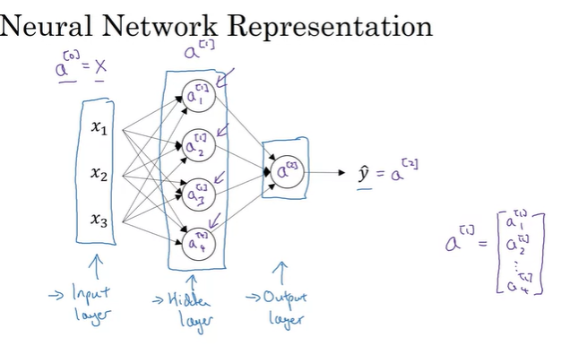

- This is a **2 layer** neural network
  - Don't count input layer
  - Hidden layer = layer 1
  - Output layer = layer 2
- Hidden layer will have parameters *w* and *b* associated with it
  - In our case w will be a 4x3 matrix => `w[4][3]`
  - 4 comes from the fact there are 4 nodes in the hidden layer
  - 3 comes from 3 input features
- Output layer also has parameters *w* and *b* associated with it
  - `w[1][4]`
    - 1 because 1 node in output layer
    - 4 comes from the 4 nodes from the hidden layer
  - `b[1][1]`

### Computing a Neural Network's Output

- Let's take first node in hidden layer as an example
- Does two computations