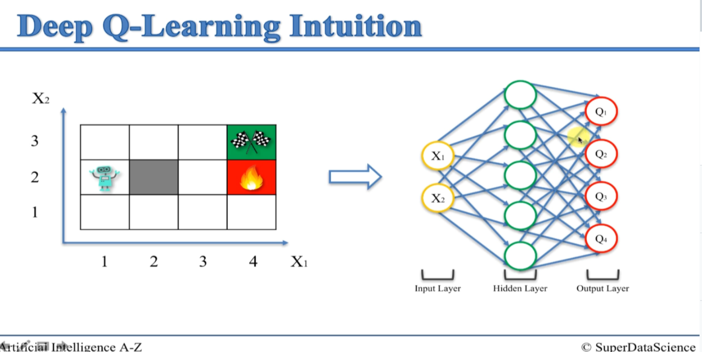

# Artificial Intelligence

- https://www.udemy.com/course/artificial-intelligence-az

## Q-Learning Intuition

### Overview

- Q-learning is a type of reinforement learning algorithm that helps an `agent` learn to make decisions in an environment in order to maximize a cumulative reward
- `Agent` - imagine you have an "agent", and it's in an environment w/ different situations or states
- `Action` - the agent can take different actions in each state. Each action has a certain impact on the environment.
- `Q-values` - for each *state-action* pair, the agent maintains a Q-value. The Q-value represents the expected cumulative reward the agent will get if it takes a specific action in a certain state
- `Learning` - the agents learns by exploring the environment and updating it's Q-values based on the rewards it receives. The key idea is that the agent learns which actions are better in each state over time
- `Exploitation and Exploration` - Q-learning balances between exploiting what it already knows (choosing actions with the highest learned Q-values) and exploring new actions to discover potentially better ones
- `Bellman equation` - Q-learning uses the Bellman equation to update it's Q-values. The equation expresses how the current Q-value should be adjusted based on the reward received and the estimated future rewards
- `Iterative process` - the agent repeats this process over many episodes of interacting with the environment, gradually improving it's Q-values and, as a result, making better decisions to maximize its total reward

### Bellman Equation

- Fundamental concept in dynamic programming and reinforcement learning
- Expresses a relationship between the value of a state (or state-action pair) and the expected cumulative reward that can be obtained from that state onward
- Two forms of the equation
  - State values
  - Action values

#### State Values (V-function)

- V(s)=R(s)+ γ ⋅ maxaQ(s,a)
  - `V(s)` = value of state `s`
  - `R(s)` = immediate reward obtained in state `s`
  - `γ` is the discount factor
    - Value between 0 and 1 that represents the importance of future rewards
    - Determines how much the agent cares about the immediate rewards versus future rewards
  - maxaQ(s,a) - represents the maximum Q-value among all possible actions `a` in state `s`

#### Action Values (Q-function)

- Q(s,a)=R(s,a)+γ⋅maxa'Q(s', a')
  - Q(s,a) is the value of taking action `a` in state `s`
  - R(s, a) is the immediate reward obtained by action `a` in state `s`
  - s' is the next state after taking action `a` in state `s`
  - maxa'Q(s', a') is the maximum Q-value among all possible actions a' in the next state s'

####

### Living Penalty

- AI is given a slight penalty for the more "things" they do in order to incentivize it to finish more quickly

### Q-Learning Intuition

- Q-learning allows us to quantify doing a certain action which then leads to a different state

- `Q(s, a)`
    - s = current state
    - a = action

## Deep Q-Learning Intuition

