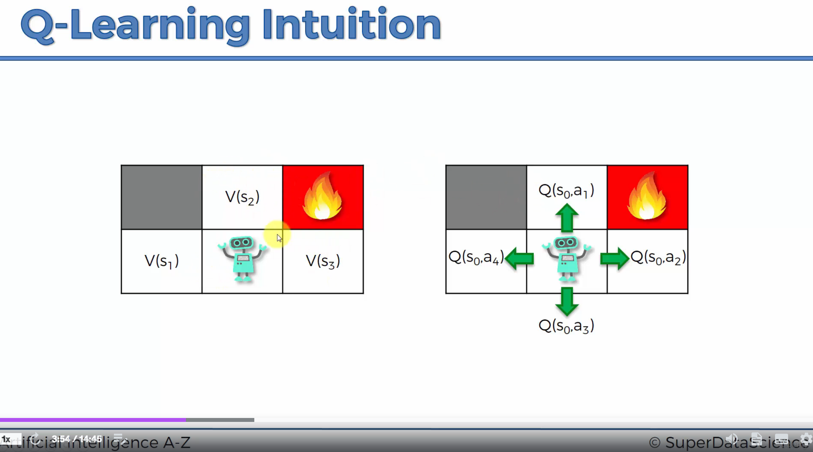

# Artificial Intelligence

- https://www.udemy.com/course/artificial-intelligence-az


```
         AI
          |
    ______________
   |              |
   ML             Robotics
   |              |
  ___        __________
 |   |      |          |
 RL  NLP    Computer Vision
 |
DQN
```

## Additional Helpful Links

- https://stats.stackexchange.com/questions/181/how-to-choose-the-number-of-hidden-layers-and-nodes-in-a-feedforward-neural-netw
  - Talks about layers in neural networks
    - Input
    - Output
    - Hidden
- https://aws.amazon.com/what-is/neural-network/
  - 

## Reinforcement Learning

- 

## Q-Learning Intuition

### Overview

- Q-learning is a type of reinforcement learning algorithm that helps an `agent` learn to make decisions in an environment in order to maximize a cumulative reward
- `Agent` - imagine you have an "agent", and it's in an environment w/ different situations or states
- `Action` - the agent can take different actions in each state. Each action has a certain impact on the environment.
- `Q-values` - for each *state-action* pair, the agent maintains a Q-value. The Q-value represents the expected cumulative reward the agent will get if it takes a specific action in a certain state
- `Learning` - the agents learns by exploring the environment and updating it's Q-values based on the rewards it receives. The key idea is that the agent learns which actions are better in each state over time
- `Exploitation and Exploration` - Q-learning balances between exploiting what it already knows (choosing actions with the highest learned Q-values) and exploring new actions to discover potentially better ones
- `Bellman equation` - Q-learning uses the Bellman equation to update it's Q-values. The equation expresses how the current Q-value should be adjusted based on the reward received and the estimated future rewards
- `Iterative process` - the agent repeats this process over many episodes of interacting with the environment, gradually improving it's Q-values and, as a result, making better decisions to maximize its total reward


### Bellman Equation

- Fundamental concept in dynamic programming and reinforcement learning
- Expresses a relationship between the value of a state (or state-action pair) and the expected cumulative reward that can be obtained from that state onward
- Two forms of the equation
  - State values
  - Action values

#### Q-function

- *Q-function satisfies the Bellman equation*
- Also known as the action-value function
- Represents the expected cumulative reward of taking a particular action in a specific state
  and following a certain policy thereafter
- Formal definition of the Q-function is denoted as `Q(s, a)`
  - *s* = current state of the environment
  - *a* = action taken by the agent
- Goal of reinforcement learning is often to find an optimal policy that maximizes the expected
  cumulative reward for the agent over time

#### State Values (V-function)

- V(s)=R(s)+ γ ⋅ max<sub>a</sub>Q(s,a)
  - `V(s)` = value of state `s`
  - `R(s)` = immediate reward obtained in state `s`
  - `γ` is the discount factor
    - Value between 0 and 1 that represents the importance of future rewards
    - Determines how much the agent cares about the immediate rewards versus future rewards
  - max<sub>a</sub>Q(s,a) - represents the maximum Q-value among all possible actions `a` in state `s`


#### Action Values (Q-function)

- Q(s,a)=R(s,a)+γ⋅max<sub>a'</sub>Q(s', a')
  - Q(s,a) is the value of taking action `a` in state `s`
  - R(s, a) is the immediate reward obtained by action `a` in state `s`
  - s' is the next state after taking action `a` in state `s`
  - max<sub>a'</sub>Q(s', a') is the maximum Q-value among all possible actions a' in the next state s'

#### Policy

- Strategy or a mapping from states to actions that guides the decision-making process of an 
  agent interacting with an environment
- Policy defines how the agent should behave in each state to maximize its cumulative reward 
  over time
- Policies can be:
  - Deterministic
    - Same reward is always chosen in a given state
  - Stochastic
    - Actions are chosen according to a probability distribution
- *The optimal policy is associated with the optimal action-value (aka Q-function) function*
- Different RL algorithms use various strategies to learn and update policies
  - **Q-Learning**
    - Optimal policy is derived from optimal Q-function by selecting actions that maximizes the 
      Q-values for each state
  - **Policy Gradient Methods**
  - **Actor-Critic Methods**


### Living Penalty

- AI is given a slight penalty for the more "things" they do in order to incentivize it to finish 
  more quickly


### Q-Learning Intuition

- Q-learning allows us to quantify doing a certain action which then leads to a different state

- `Q(s, a)`
    - s = current state
    - a = action


## Deep Q-Learning Intuition

### Deep Q-learning Intuition - Learning

- `DQN` = Deep Q Networks
- Can represent states by `(x1, x2)`
- Right hand side is a *neural network*
- Q values dictate what action to take
- An *epoch* refers to one complete pass through the entire training dataset during the training 
  phase of a neural network


- Why do this?
- Q-learning works in very simple environments
- The neural network will predict the possible outcomes for you
  - In our example this means 4 values because we can go left, right, up, down
- In deep Q-learning there is no before or after

<br>

- What the neural network does is it calculates the Q values based on what actions can be 
  performed given a specific state, and then it compares these calculated values against the target
  - Neural networks learn by looking at the differences between calculated vs target
    - These targets come from the time the agent was in this square previously
    - They update their weights


- We calculate the loss function doing the below
- So we calculate the square of the target minus q value calculated for all the different 
  outcomes and sum those
  - Want this to be as close to 0
- This loss gets propagated back through the neural network so the weights of the graph (the 
  "synapses") can get updated so the weights are more accurate for the environment
- This process continues on, and this is how the agent learns


### Deep Q-Learning Intuition - Acting

- There is a "soft max" function that chooses the "best" action to achieve the desired Q value


## Experience Replay

- Involves storing and randomly sampling experiences (or transitions) to train the model 
  rather than using each experience only once in the order it was encountered
- Some experiences can be very rare so this can be missed if each experience is processed at the 
  time they happen
- Breaks 

## Types of Problems

### Regression

- Type of supervised learning task where the goal is to predict a continuous numerical output 
  based on input features
- Aims to learn a mapping from input variables to continuous output variables

## Hyperparameters

- Configuration settings that are not learned from the training data but must be set before
  training the model
- These significantly influence the performance and behavior of the deep Q-learning algorithm

#### Learning Rate

- Controls the step size in the weight updates during the optimization process
- Determines how much the Q-values are updated in each iteration
- Too high of a learning rate may lead to instability, while too learning of a learning rate may 
  result in slow convergence

#### Discount Factor

- Determines the importance of future rewards in the Q-value updates
- Influences how much the agent values immediate rewards compared to future rewards
- A high discount factor gives more weight to future rewards, encouraging the agent to consider 
  long-term consequences

#### Exploration-Exploitation Trade-off

- Usually controlled by th epsilon-greedy strategy
- Determines the probability of choosing a random action (*exploration*) versus selecting the 
  action with the highest estimated Q-value (*exploitation*)
- Balancing exploration and exploitation is critical for effective learning

#### Replay Buffer Size

- Stores experiences (state, action, reward, next state) and is sampled during training
- Determines how many experiences are stored
- A larger batch size can improve stability of the learning process but may require more computation

#### Target Q-Network Update Frequency

- In deep Q-learning, there are two Q-networks
  - Target Q-network
  - Online Q-network
- Target Q-network is updated less frequently to stabilize training
- Frequency of updating the target Q-network is a hyperparameter that affects the convergence 
  and stability of algorithm

#### Q-Network Architecture

- The architecture of the Q-network itself, including the number of layers, the number of 
  neurons in each layer, and the choice of activation functions, is a set of hyperparameters 
  that impact the model's capacity to learn and represent the Q-function

#### Loss Function

- Measures the discrepancy between the predicted values (Q-values) and the target values during 
  the training process
- Common choices include the mean squared error loss or Huber loss