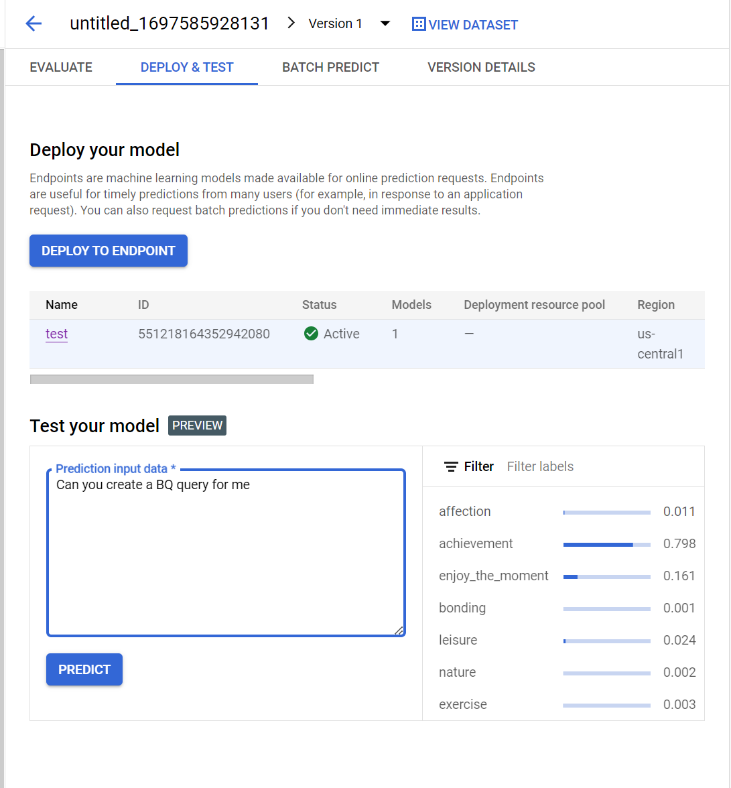

# Vertex AI

- GCP's AI and ML solution

## Generative AI

- https://cloud.google.com/vertex-ai/docs/generative-ai/learn/introduction-prompt-design
- https://cloud.google.com/vertex-ai/docs/generative-ai/learn/introduction-prompt-design#things-to-avoid
- https://cloud.google.com/bigquery/docs/reference/standard-sql/bigqueryml-syntax-detect-anomalies
- https://cloud.google.com/blog/topics/developers-practitioners/anomaly-detection-tensorflow-probability-and-vertex-ai
- https://cloud.google.com/vertex-ai/docs/text-data/classification/prepare-data
- https://cloud.google.com/vertex-ai/docs/tabular-data/classification-regression/get-batch-predictions?authuser=2&hl=en
  - Talks about input data here

- *Prompt design* is the process of creating prompts that elicit the desired response from the 
  language model

### What is a prompt?

- Natural language request submitted to a language model to receive a response back
- Can contain questions, instructions, contextual information, examples, and partial input for 
  the model to complete or continue
- Model can generate text, code, images, videos...

#### Prompt Content Types

- Input (required)
- Context (optional)
- Examples (optional)

##### Input

- Text in the prompt you want the model to provide a response for, and it's required context type
  - Inputs can be a question that the model answers - `question input`
  - Task the model performs - `task input`
  - An entity the model operates on - `entity input`
  - Partial input that the model completes or continues - `completion input`

##### Context

- Instructions that specify how the model should behave
- Information that the model uses or references to generate a response

##### Examples

- Input/output pairs that you include in the prompt to give an example of an ideal response
- Effective strategy for customizing the response format

### Fine Tuning

- Taking pre-trained model and training it on a domain specific data set

### Few Shot Prompting

- Technique to enable in context learning where person provides demonstrations in prompt to 
  steer the model to better performance
  - Examples serve as conditioning for subsequent examples where we would like the model 
    generate a specific type of response

## Training Auto ML Text Classification

- Giving it input just replies with what type of activity it thinks this is

